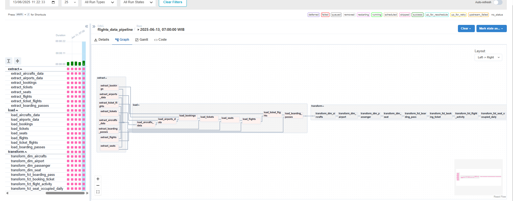
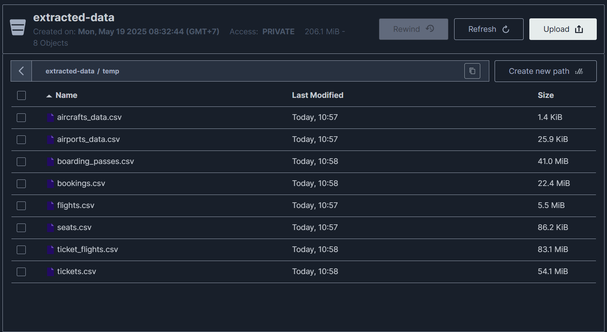

# Flights Data Pipeline

## Project Overview
An end-to-end data pipeline for a simulated flight-booking system.  It **extracts** relational data from a source Postgres database, lands it as CSV files in **MinIO**, **loads** the files into a staging schema in another Postgres instance, then **transforms** the data into star-schema dimension & fact tables.  Everything is orchestrated with **Apache Airflow 2.8** inside Docker-Compose.

## Architecture
```
┌─────────────┐       Extract        ┌───────────────┐        Load         ┌─────────────┐
│  Postgres   │  ───────────────▶   │    MinIO      │  ───────────────▶   │  Postgres   │
│  (bookings) │    CSV (temp/)      │  bucket        │    COPY / INSERT   │ (warehouse) │
└─────────────┘                      └───────────────┘                      └─────────────┘
        ▲                                   ▲                                     ▲
        └───────────────  Airflow DAG  ─────┴───────────────  SQL  ───────────────┘
```
Components:
* **Airflow** (LocalExecutor) – orchestrates the DAG (`flights_data_pipeline`).
* **Source DB** – Postgres with `bookings` schema (initialised by `source_init.sql`).
* **Object Store** – MinIO bucket `extracted-data` for intermediate CSV files.
* **Warehouse** – Postgres with `stg` & `final` schemas (DDL in `staging_schema.sql` & `warehouse_init.sql`).
* **Docker-Compose** – one-click local stack.

## Pipeline Flow
1. **Extract** (dynamic Python tasks)
   * For each table in `tables_to_extract` Airflow Variable.
   * Incremental mode uses `updated_at` ≥ `{{ ds }}` & ≤ `{{ ds }} 23:59:59`.
2. **Load** (dynamic Python tasks)
   * Downloads CSV from MinIO and UPSERTs into `stg.<table>`.
   * Skips automatically when corresponding extract task skipped.
3. **Transform** (dynamic Postgres tasks)
   * Executes SQL scripts in `include/transformations/` to populate dimensions & facts.

## How to Run
```bash
# 1. Clone repo & move in
$ git clone https://github.com/<your_account>/flights-data-pipeline.git
$ cd flights-data-pipeline

# 2. Configure .env (sample provided)
$ cp .env.example .env  # then edit values; set AIRFLOW_ADMIN_PWD, MINIO creds, etc.

# 3. Generate Fernet key (optional helper)
$ python fernet.py  # copy output into AIRFLOW_FERNET_KEY in .env

# 4. Start the full stack
$ docker compose up --build -d

# 5. Open services
* Airflow:  http://localhost:8080  (user: admin / pwd: value of $AIRFLOW_ADMIN_PWD)
* MinIO:    http://localhost:9001  (user & pwd from .env)
```

## Repository Contents
* `dags/` – DAG code.
* `include/` – DDL & transformation SQL.
* `Dockerfile`, `docker-compose.yml`, `start.sh` – container definitions.
* `requirements.txt`, `.env.example` – dependencies & configuration.
* `images/` – architecture / UI screenshots.

## Screenshots

## DAG Graph



## MinIO bucket



## Troubleshooting
* **DAG missing?** – run `docker compose logs airflow_standalone` for import errors.
* **Task skipped?** – likely no rows matched incremental window.
* **Connection errors?** – verify Variables & Connections auto-created by `start.sh` or set manually.

## License
MIT
